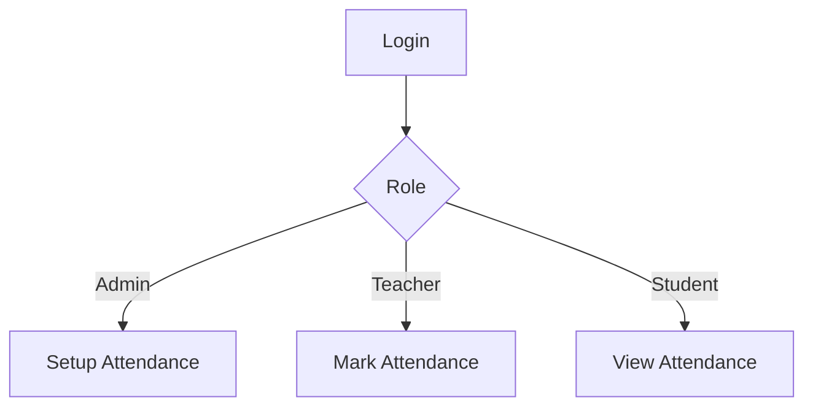

<<<<<<< HEAD
#diagram of attendance

=======
# User-Flow-Diagram-for-EduGuard360
EduGuard360 is a school management software. It's an existing software. Our development team is trying to expand it using Django framework. In this repository, I have prepared the module wise user flow diagram. Our development team will be benefitted for it. Even it will be essential for testing phase.
>>>>>>> abd2179957d5b9bb1b31834861903e1dbdf39b6a
