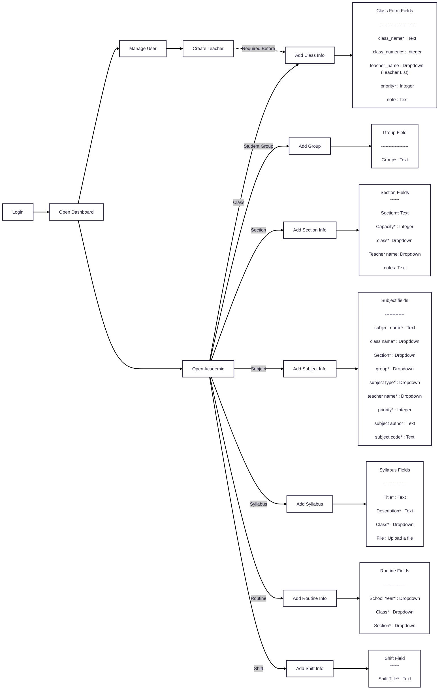

<<<<<<< HEAD
#For academic user flow diagram
=======
### For academic user flow diagram
>>>>>>> cb1cc7175bba878c31879e62f91ab21bf228475c

```mermaid
   ---
config:
  theme: redux
  look: classic
---
flowchart LR

    A[Login] --> B[Open Dashboard]
    B --> MU[Manage User]
    MU --> T[Create Teacher]

    B --> AC[Open Academic]

    AC -->|Class| C[Add Class Info]
    AC -->|Student Group| M[Add Group]
    AC -->|Section| E[Add Section Info]
    AC -->|Subject| D[Add Subject Info]
    AC -->|Syllabus| F[Add Syllabus]
    AC -->|Routine| G[Add Routine Info]
    AC -->|Shift| H[Add Shift Info]
    T -. Required Before .-> C

%%Class Field
    C --> C1["Class Form Fields<br>
    ------------------------<br>
    class_name* : Text<br>
    class_numeric* : Integer<br>
    teacher_name : Dropdown (Teacher List)<br>
    priority* : Integer<br>
    note : Text"]

 %%Group Field
    M --> GP["Group Field<br>
    ------------------<br>
    Group* : Text"]

%%Section Field
    E --> sec[" Section Fields<br>------<br>
    Section*: Text <br> 
    Capacity* : Integer<br> 
    class*: Dropdown<br>
    Teacher name: Dropdown<br>
     notes: Text"]

%%Subject Fields
    D --> sub["Subject fields <br>
    -------------<br>
    subject name* : Text<br>
    class name* : Dropdown <br>
    Section* : Dropdown<br>
     group* : Dropdown<br>
    subject type* : Dropdown<br> 
    teacher name* : Dropdown<br>
    priority* : Integer <br>
    subject author : Text <br>
    subject code* : Text"]


%%Syllabus Field
    F --> syl["Syllabus Fields<br>
    --------------<br>
    Title* : Text<br>
    Description* : Text<br>
    Class* : Dropdown<br>
    File : Upload a file"]
%%Routine Field
    G --> Rot["Routine Fields<br>
    --------------<br>
    School Year* : Dropdown<br>
    Class* : Dropdown<br>
    Section* : Dropdown<br>"
    ]
%%Shift field
    H --> sft["Shift Field <br> ------<br> 
    Shift Title* : Text"]

```
